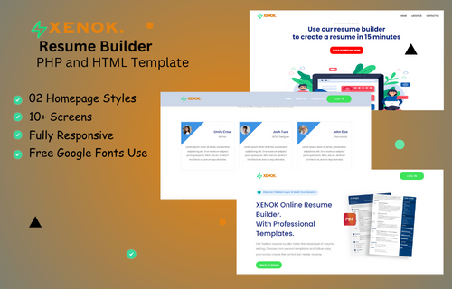

# XENOK. Resume Builder

This is a resume builder template that creates resume for its user, after the successful purchase of the site, you edit the necessary things and have your fully functional site. It was made with Php, Json, Js, and with Css as its stylesheet, it also has free SEO in it.

### Prerequisites

Before you start working on the site pls ensure that, you have knowledge of Html, Php, Css, Js and you have the permission to edit it.

### Thumbnail

### Resources Used in This Project

Images: Too many to remember  
Fonts: https://fontsource.org/ & https://sharefonts.net & https://fontawesome.com/ & https://freefontsfamily.com/ & https://daefontfree.io  
Svg Icons From: https://icons8.com & https://freesvg.org/ & https://fontawesome.com/v4/icons/   

### Incase of Emergency

If you want to contact with me you can reach me at [WhatsApp](https://wa.me/2348182540860?text=Hi%20am%20)
